# UniView

In this application you can search for your best option through hundred of updated universities around the world. Users can grade and add a comment to institutions so others can see if it fits for them. Only verified ratings, using Microsoft Text Analysis will be displayed. After creating an account, the user can activate it to claim a university and add verified informations about it. The user needs to provide full informations and will be contacted by administrators in order to securely activate the account. The information accuracy depends on institution representant.

## Development

The application is also live [HERE](https://universityraking.web.app/). 
This project was created using [Angular CLI](https://github.com/angular/angular-cli) version 8.3.2 with [TypeScript](https://www.typescriptlang.org/), [Angular Material](https://material.angular.io/), [Microsoft Text Analytics](https://azure.microsoft.com/en-us/services/cognitive-services/text-analytics/), [Google Maps API](https://developers.google.com/maps/documentation), [Google Charts](https://developers.google.com/chart) and [RxJs](https://www.npmjs.com/package/rxjs) 
For database used to store the data is [Firebase Firestore](https://firebase.google.com/docs/firestore). 
 
To run the project on your machine use `ng serve` for a dev server. Navigate to `http://localhost:4200/`. The app will automatically reload if you change any of the source files.

## Screenshots
* General access
    * Homepage 
    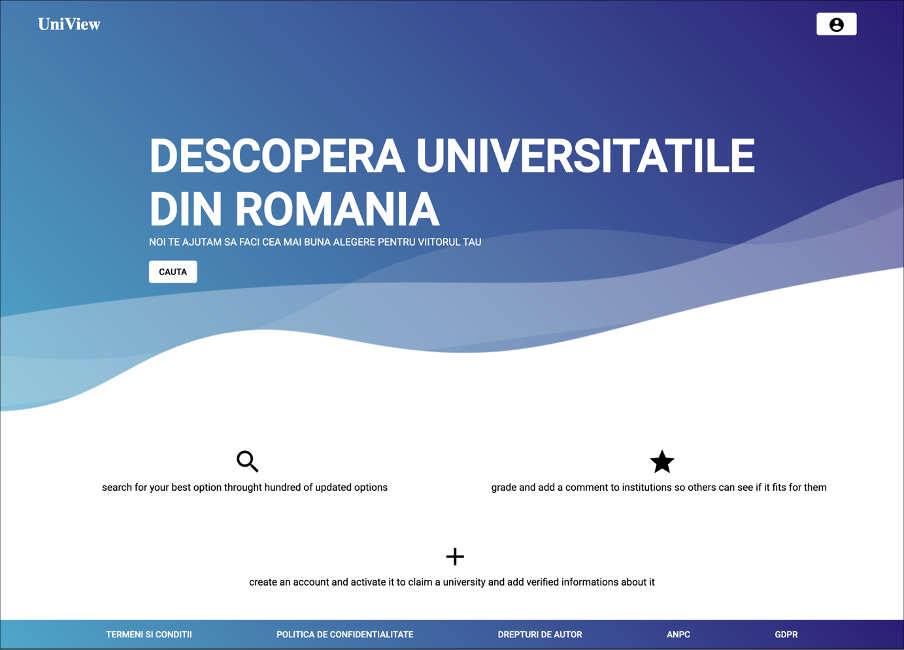
    * Login 
    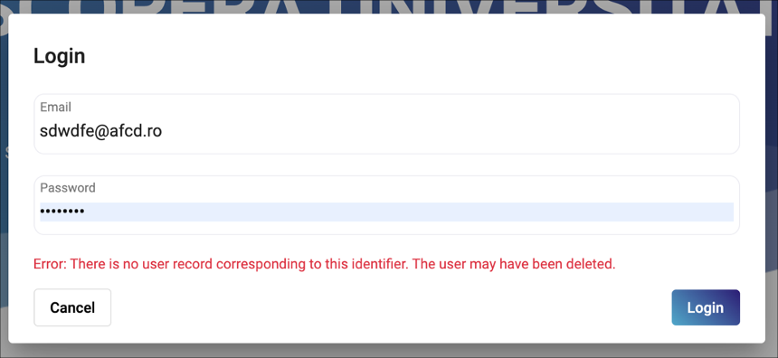
    * Search page 
    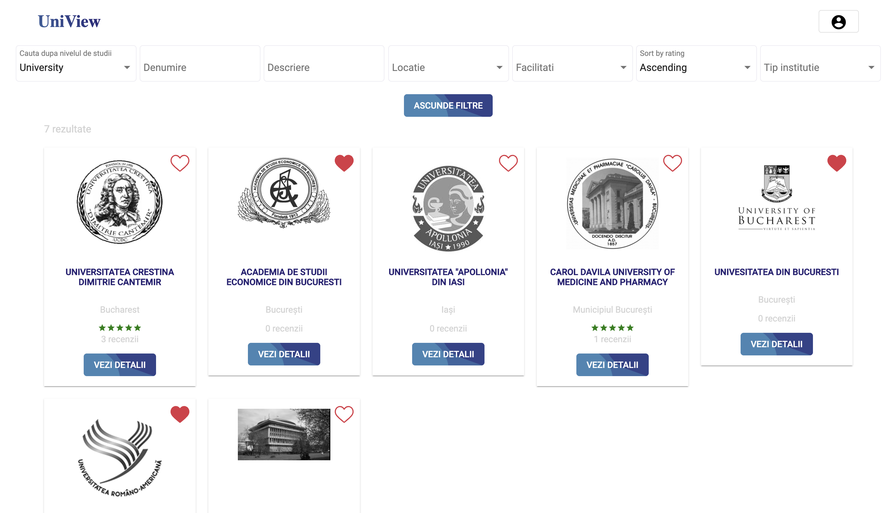
    * University details 
    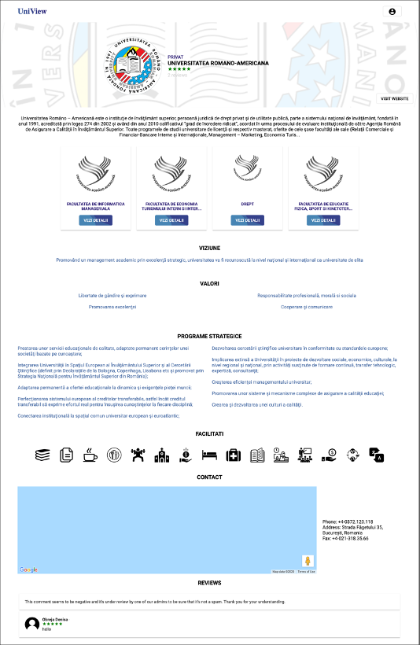
    * Faculty details 
    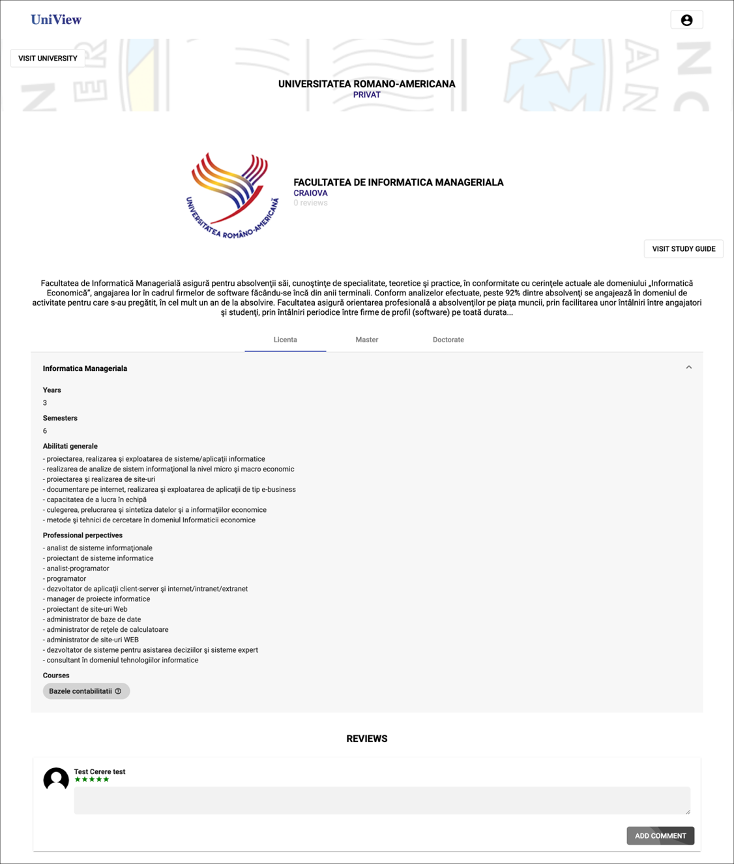
    * Course details 
    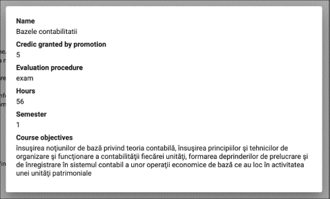
* Users with general account access
    * User details 
    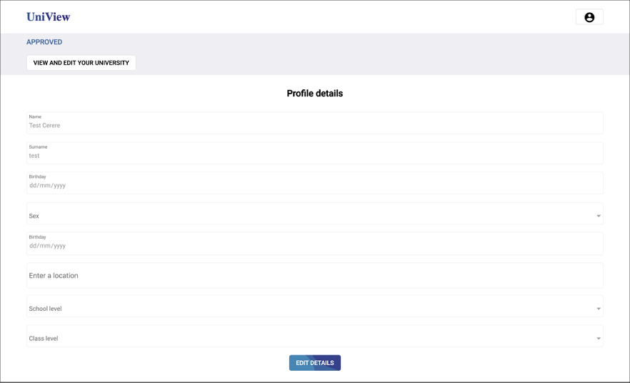
* Users with university account access
    * University edit 
    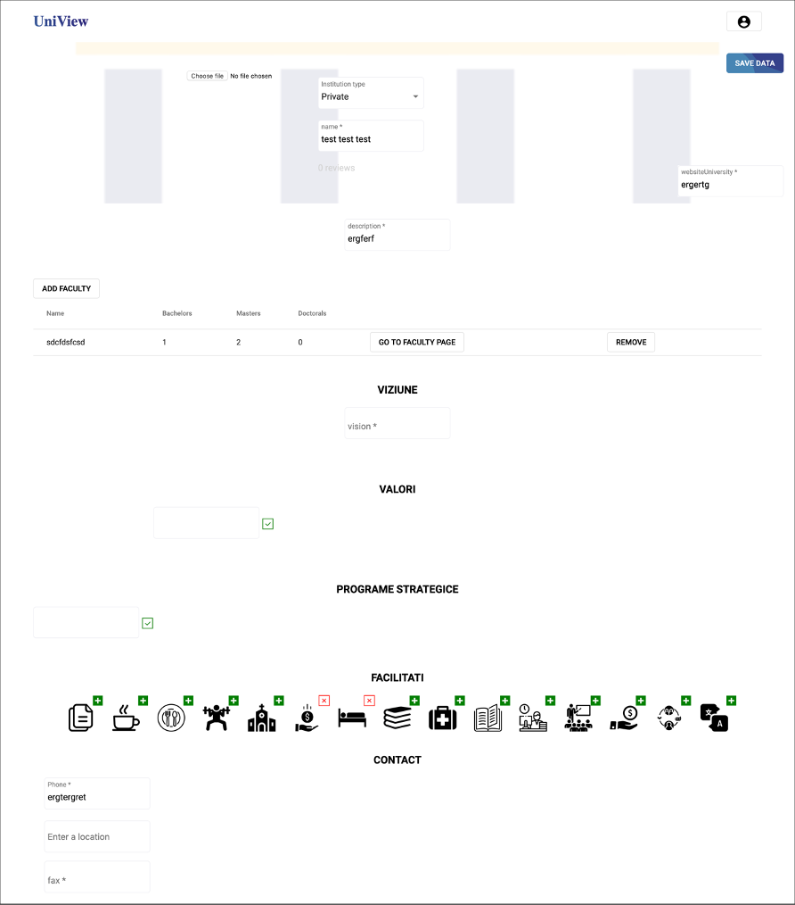
    * Faculty edit 
    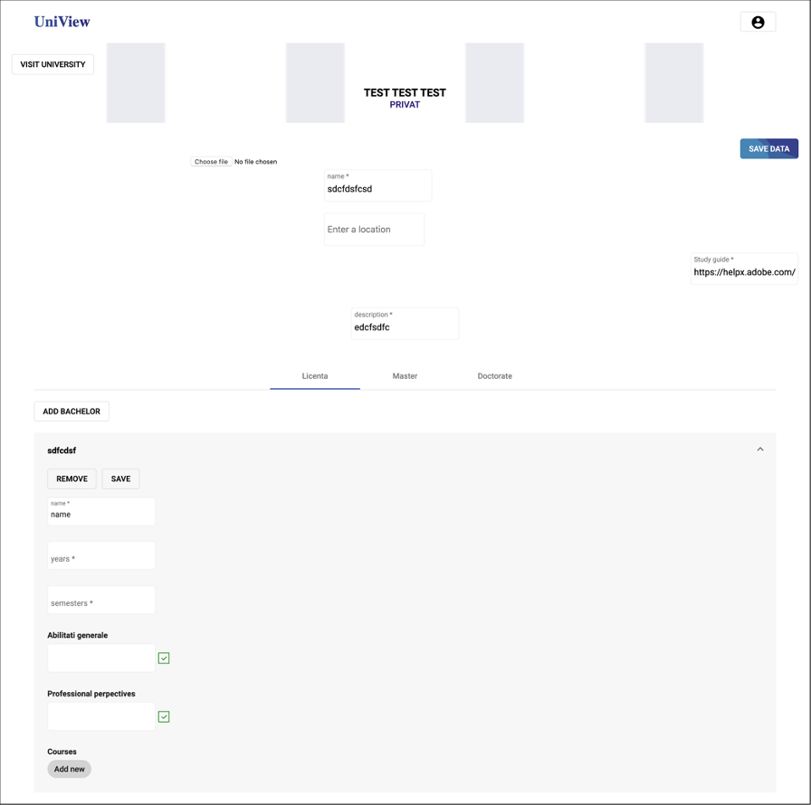
* Administrators access
    * Barchart statistics  
    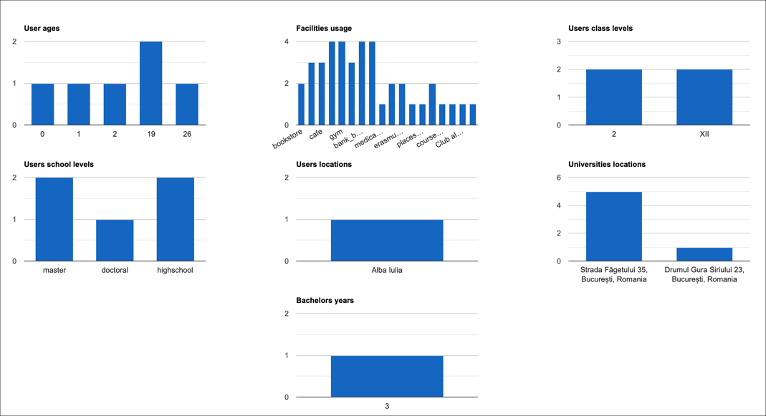
    * Piechart statistics 
    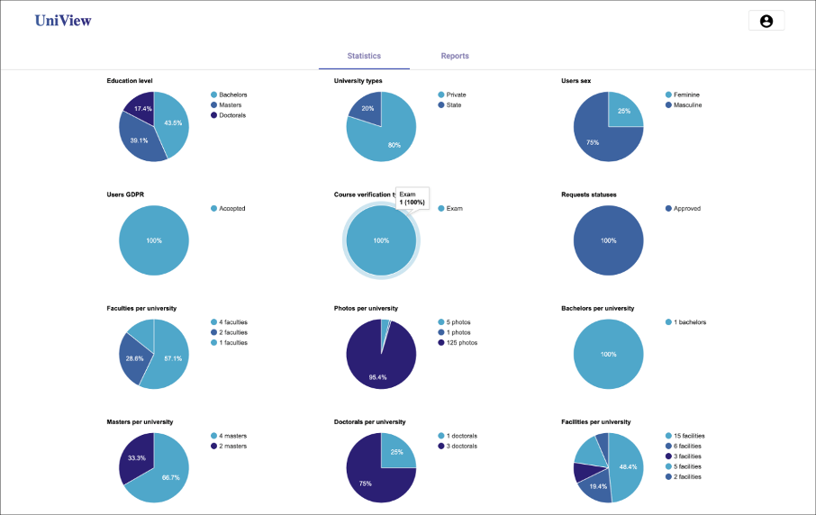
    * Raports 
    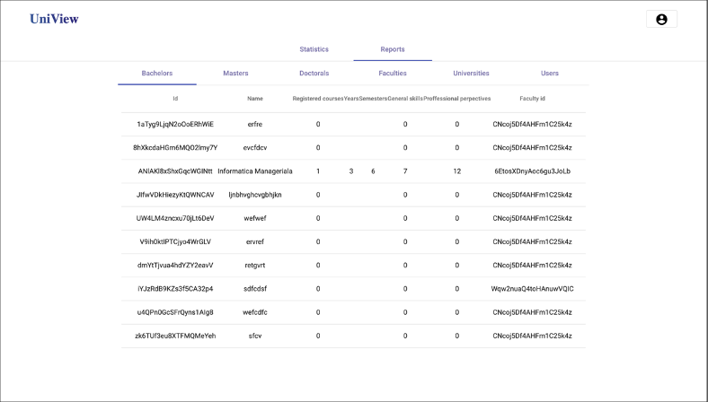
    * Requests 
    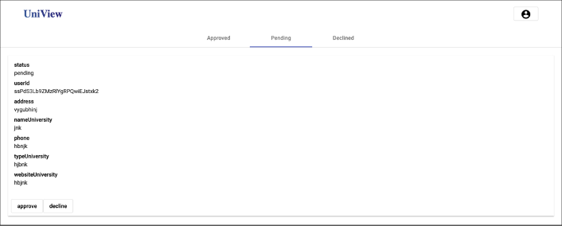
* Database  
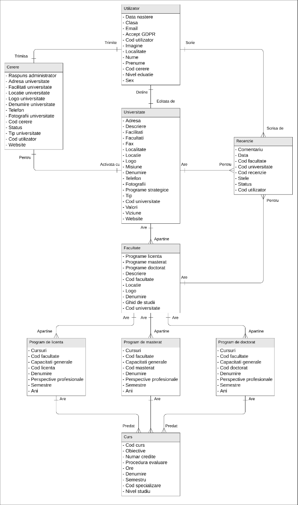
